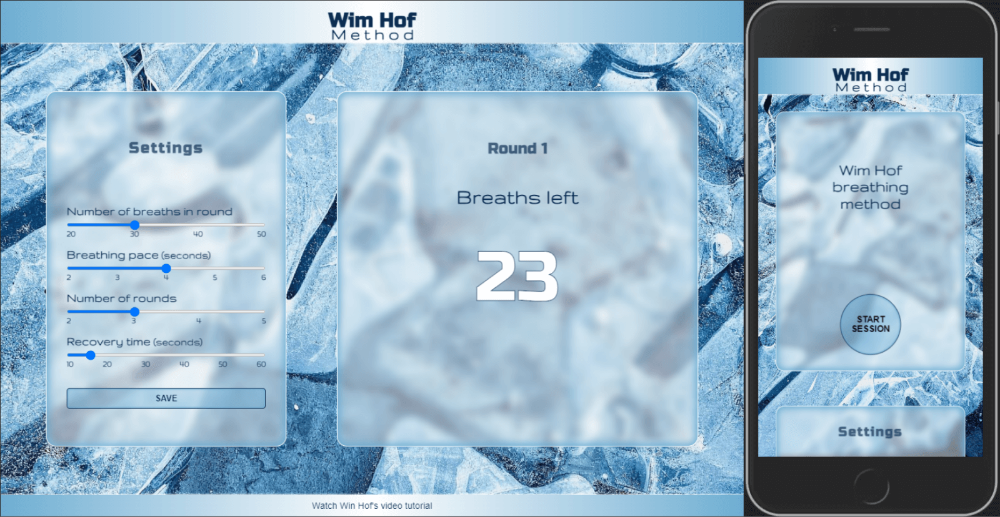

## Wim Hof breathing method

### Helped me when I was disabled

[Live Demo](https://sinisavukmirovic.github.io/Wim-Hof-Method/ "Wim Hof breathing App")

___

### Realised what the bug was!
### Omitting the option { once: true } in added event lister, to have it to only fire one time, was breaking the app...

### Using .addEventListener()’s once Option
#### The .addEventListener() method comes with a tool to help clean itself up if it’s intended for a one-time use: the once option. It’s about as simple as it sounds. If it’s set to true, the listener will automatically remove itself after first being invoked:

<code>
    const button = document.getElementById('button');

    button.addEventListener('click', () => {
        console.log('clicked!');
    }, { once: true });

    // 'clicked!'
    button.click();

    // No more listeners!
    getEventListeners(button) // {}
</code>

#### Assuming it fits your use case, this approach might be appropriate if you’re keen on using an anonymous function, given that your listener only needs to be invoked once.

[About Event Listeners](https://www.macarthur.me/posts/options-for-removing-event-listeners)